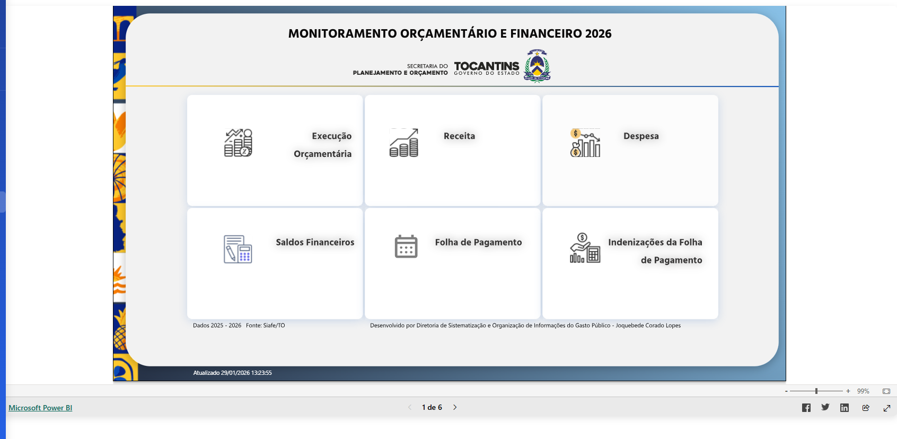

# BI Financial Dashboard

Projeto de Business Intelligence com foco em análise financeira, desenvolvido para demonstrar habilidades analíticas, modelagem de dados e visualização no Power BI.

---

## 📊 Descrição do Projeto

Este projeto tem como objetivo apresentar uma análise financeira organizada, clara e orientada à tomada de decisão, simulando um cenário real de acompanhamento orçamental.

O dashboard permite visualizar receitas, despesas, resultados fiscais e indicadores financeiros ao longo do tempo.

---

## 🎯 Objetivo

- Analisar receitas e despesas
- Identificar variações financeiras por período
- Apoiar a tomada de decisão
- Demonstrar boas práticas em projetos de BI

---

## 🧠 Indicadores Analisados

- Receita total  
- Despesa total  
- Resultado financeiro  
- Evolução mensal  
- Comparativo anual (2025 x 2026)  
- Análise orçamental  

---

## 🛠️ Ferramentas Utilizadas

- Power BI  
- Power Query  
- DAX  
- Modelagem de Dados  
- GitHub  

---

## 📷 Prints do Dashboard

### Visão Geral
*(print será adicionado posteriormente)*

### Receita e Despesa
*(print será adicionado posteriormente)*

### Comparativo Anual
*(print será adicionado posteriormente)*

### Comparativo Anual

