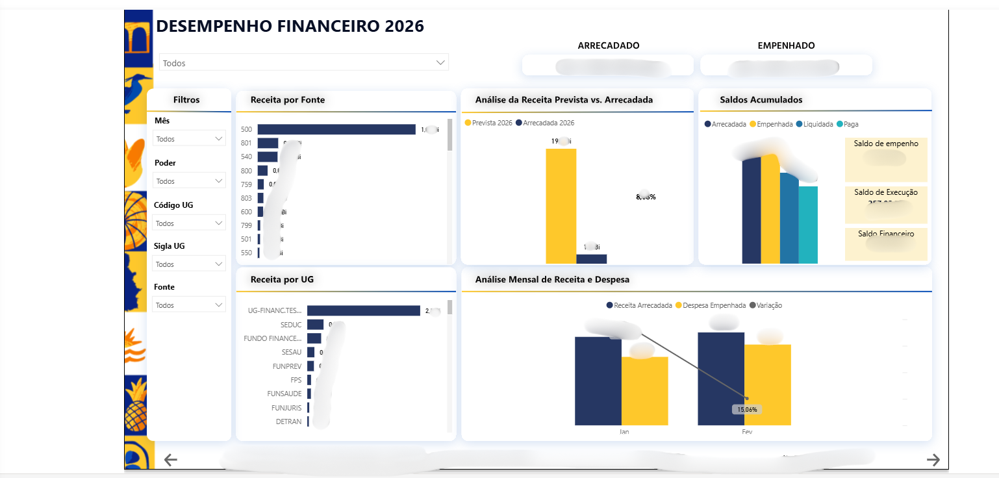
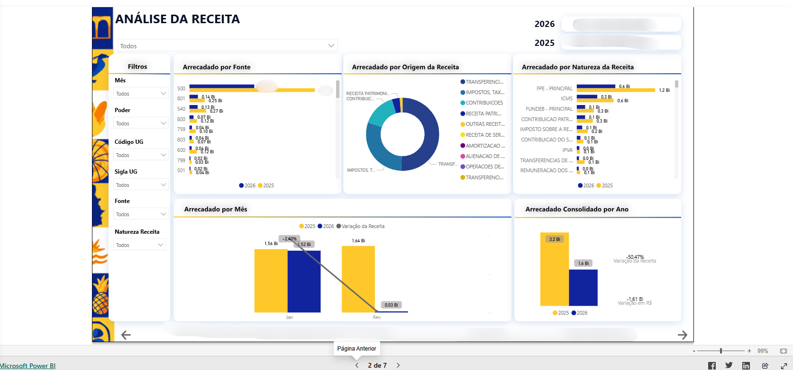
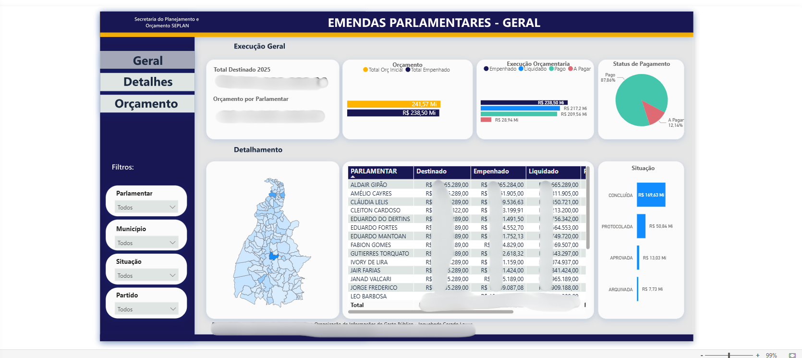

# 📊 BI Financial Dashboard

Projeto de **Business Intelligence** com foco em **análise financeira e orçamental**, desenvolvido para demonstrar competências em Power BI, análise de dados e visualização de indicadores orientados à tomada de decisão.

---

## 🎯 Objetivo do Projeto
Analisar receitas, despesas e execução orçamental, incluindo o acompanhamento de **emendas parlamentares**, através de dashboards interativos e intuitivos.

---

## 📈 Análises e Indicadores
- Receita total  
- Despesa total  
- Evolução mensal  
- Comparativo anual (2025 × 2026)  
- Execução orçamental  
- Análise de emendas parlamentares  

---

## 🛠️ Ferramentas Utilizadas
- Power BI  
- Power Query  
- DAX  
- Modelagem de Dados  
- GitHub  

---

## 📷 Exemplos do Dashboard

### Visão Geral Financeira

### Receitas

### Emendas Parlamentares
Dashboard analítico para acompanhamento da execução orçamental de emendas parlamentares, com filtros por parlamentar, município, situação e partido.

---

## 📁 Estrutura do Projeto

---

## 👤 Autor
**Paulo Victor**  
Business Intelligence Júnior | Power BI | Análise de Dados  

📍 Interesse em oportunidades de BI Júnior em Portugal  

*Dashboard desenvolvido com dados públicos/simulados para fins de estudo e portfólio.*

